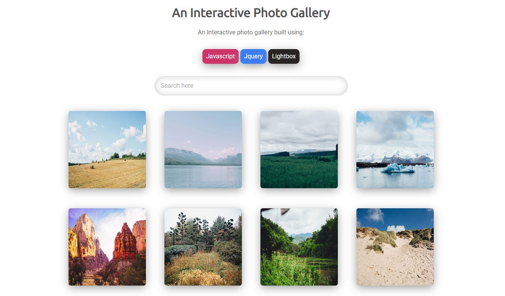

# Teachdegree-project 5
> A mobile-friendly interactive photo gallery built using JavaScript and jQuery with a search box.

## Table of contents
* [General info](#general-info)
* [Screenshots](#screenshots)
* [Technologies](#technologies)
* [Features](#features)
* [Contact](#contact)

## General info
This project demonstrates my use of JavaScript and jQuery to implement a plugin called lightbox to create a responsive photo gallery allowing the user to cycle through photos and use the search bar to use keywords to filter out content.

## Screenshots

## Technologies
* CSS3
* HTML5
* SASS
* JavaScript
* jQuery
* lightbox (plugin: https://lokeshdhakar.com/projects/lightbox2/)

## Features
List of features ready and TODOs for future development
* Search box that uses jQuery allowing the use of keywords to filter photos
* Flexbox layout
* Mobile-first design
* SASS
* Interactive Gallery

To-do list:
* Allow users to login and upload photos

## Contact
Created by [@JordanBurch101](https://github.com/Jordanburch101) - feel free to contact me!